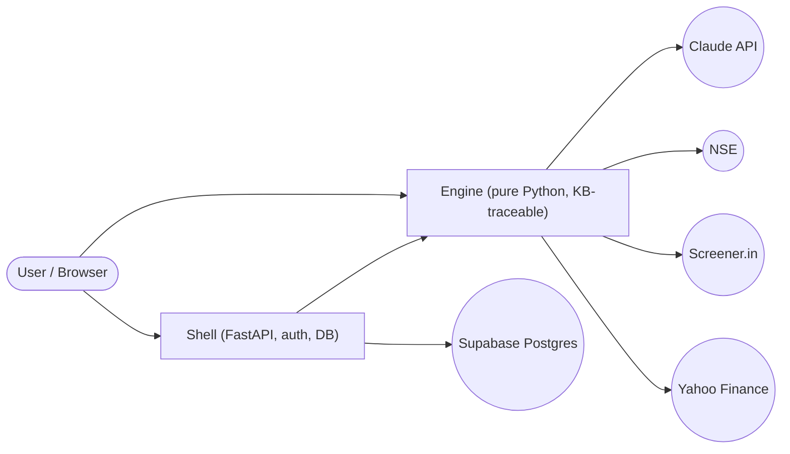
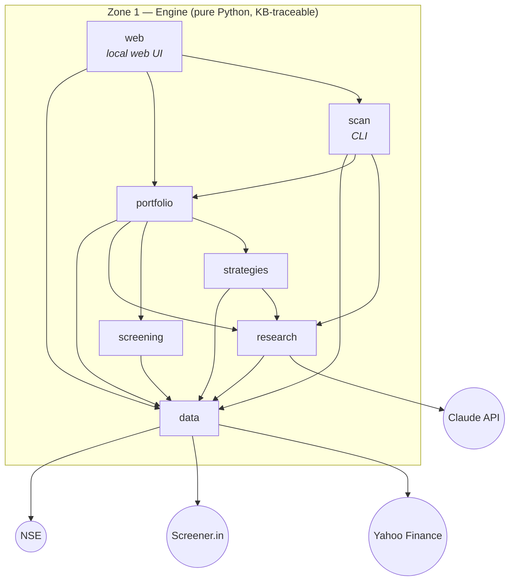
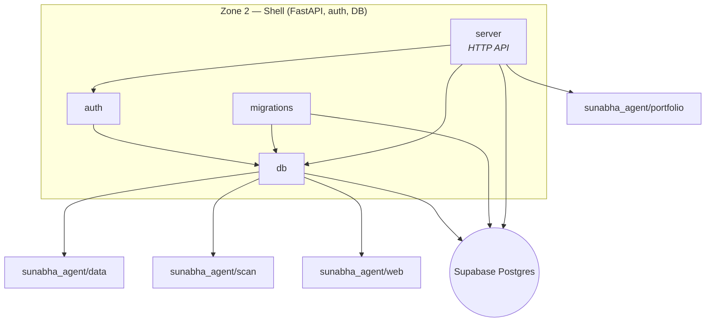

# Architecture — block diagrams

**AUTO-GENERATED — do not edit by hand.** Derived from import
analysis of the actual code. Regenerate after structural changes:

```bash
python3 .github/scripts/generate_architecture.py
```

CI (architecture workflow) fails any PR where this file is stale.

Growth plan: the L0 diagram stays zone-level forever; L1 diagrams
are one-node-per-package (files never appear); a zone exceeding
~12 packages gets split into per-package L2 sections.

## L0 — zones and external systems



## L1 — Zone 1 — Engine (pure Python, KB-traceable)



## L1 — Zone 2 — Shell (FastAPI, auth, DB)



## L1 — Zone 3 — Frontend (React + TypeScript)

_(zone not present yet)_

## Reading guide

- Solid arrows = imports (zone-internal or cross-zone) or a
  detected call-out to an external system.
- Cross-zone arrows only ever point from shell to engine —
  the reverse would violate engine purity (ADR-0005; enforced by
  tests/test_app_db.py::TestEnginePurity).
- Module responsibilities live in each package's MODULE.md (L4);
  this file shows SHAPE, the cards show MEANING.
